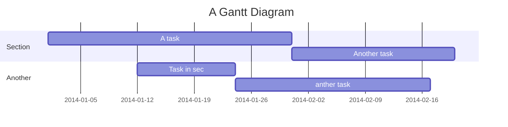

Prioritize
===
**Prioritize** is an app will allow people to prioritize their work, assignments, or tasks based on which tasks have a higher priority and list them accordingly

## Table of Contents

[TOC]


## Overview


### App Evaluation

- **Category:** Task Manager, Productivity
- **Mobile:** Push notification, Save content on your Google Calendar
- **Story:** Allow people to prioritize their work, assignments, or tasks based on which tasks have a higher priority and list them accordingly
- **Market:**  This app is targeted specifically at students both college-level and high-school. However, it can cater towards any person who needs use of it.
- **Habit:** This app is meant for daily/ weekly use. 
- **Scope:** The scope of the app is a more specialized To-do app with more complex feature to better suit the user.

## Product Spec

### 1. User Stories (Required and Optional)

**Required Must-have Stories**
- [ ] User can create a task, each with a Title, Description, Priority number, and Due date.
- [ ] App will prioritize the tasks based on Priority Number and Due date.
- [ ] User can view a list of priority items.
- [ ] User can successfully add and remove items from the priority list.
- [ ] User's list of items persisted upon modification and and retrieved properly on app restart.
- [ ] User will be notified of upcoming assignments within a specified time frame. 
- [ ] User's priority tasks will be intuitively filled into their google calendar if they have a google account. 


**Optional Nice-to-have Stories**

- [ ] Modify layout to make it more user-friendly.
- [ ] User has the ability to sort in multiple ways, including manually.

### 2. Screen Archetypes

* Task list screen
   * App will prioritize the tasks based on Priority Number and Due date.
   * User can view a list of priority items.
   * User can successfully add and remove items from the priority list.
   * User's list of items persisted upon modification and and retrieved properly on app restart.
* Task creation screen
   * User can create a task, each with a Title, Description, Priority number, and Due date.
   * User's priority tasks will be intuitively filled into their google calendar if they have a google account. 

### 3. Navigation
**Flow Navigation** (Screen to Screen)

* Home Screen
   * Will show list
   * ...
* [list second screen here]
   * [list screen navigation here]
   * ...

## Wireframes
[Add picture of your hand sketched wireframes in this section]


### [BONUS] Digital Wireframes & Mockups

### [BONUS] Interactive Prototype

## Schema 
[This section will be completed in Unit 9]
### Models
[Add table of models]
### Networking
- [Add list of network requests by screen ]
- [Create basic snippets for each Parse network request]
- [OPTIONAL: List endpoints if using existing API such as Yelp]


---
```gherkin=

```


```gherkin=

```


> Read more about sequence-diagrams here: http://bramp.github.io/js-sequence-diagrams/

Project Timeline
---

[Link to GitHub](https://github.com/Oceanwalker10/Prioritize)
## Appendix and FAQ

:::info
**Find this document incomplete?** Leave a comment!
:::

###### tags: `Group Project` `Documentation`
