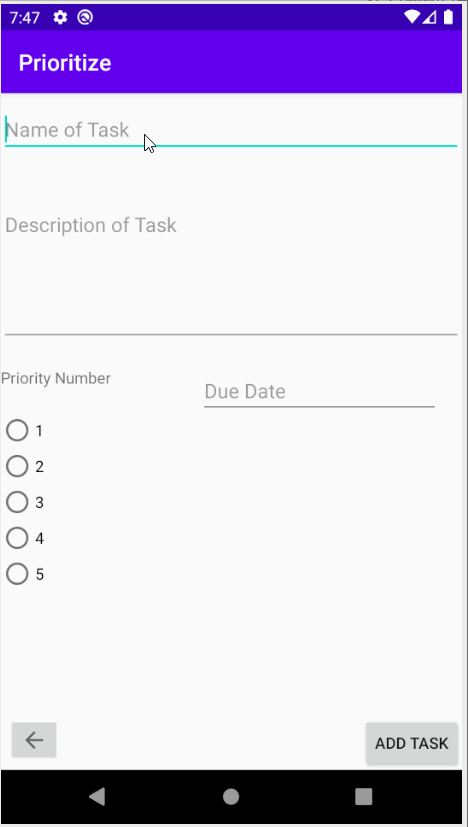
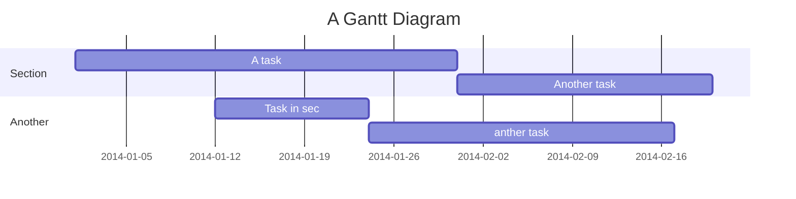

**Prioritize** is an app will allow people to prioritize their work, assignments, or tasks based on which tasks have a higher priority and list them accordingly

## Overview

### App Evaluation

- **Category:** Task Manager, Productivity
- **Mobile:** Push notification, Save content on your Google Calendar
- **Story:** Allow people to prioritize their work, assignments, or tasks based on which tasks have a higher priority and list them accordingly
- **Market:**  This app is targeted specifically at students both college-level and high-school. However, it can cater towards any person who needs use of it.
- **Habit:** This app is meant for daily/ weekly use. 
- **Scope:** The scope of the app is a more specialized To-do app with more complex feature to better suit the user.

## Product Spec

### 1. User Stories (Required and Optional)

**Required Must-have Stories**
- [x] User can create a task, each with a Title, Description, Priority number, and Due date.
- [x] App will prioritize the tasks based on Priority Number and Due date.
- [x] User can view a list of priority items.
- [X] User can successfully add and remove items from the priority list.
- [x] User's list of items persisted upon modification and and retrieved properly on app restart.
- [ ] User will be notified of upcoming assignments within a specified time frame. 
- [X] User has the ability to sort in multiple ways.

**Optional Nice-to-have Stories**

- [x] Modify layout to make it more user-friendly.
- [x] User's priority tasks will be intuitively filled into their google calendar if they have a google account. 

## Video Walkthrough

Here's a walkthrough of implemented user stories:

**Milestone 2 Gif**

**Milestone 3 Gif**

GIFs created with [LiceCap](http://www.cockos.com/licecap/).
### 2. Screen Archetypes

* Task list screen
   * App will prioritize the tasks based on Priority Number and Due date.
   * User can view a list of priority items.
   * User can successfully add and remove items from the priority list.
   * User's list of items persisted upon modification and and retrieved properly on app restart.
* Task creation screen
   * User can create a task, each with a Title, Description, Priority number, and Due date.
   * User's priority tasks will be intuitively filled into their google calendar if they have a google account. 

### 3. Navigation
**Flow Navigation** (Screen to Screen)

* Home Screen
   * Will show list of Tasks
   * Long click on each Task to edit, mark as complete, or delete.
* Edit screen
   * Will be where you edit a task for priority or due date.
* Task Screen
    * Where task will be created to add to home screen
* Action Bar
    * Setting button to change sort technique.
* Settings Screen
    * allow sort to be changed

## Wireframes

### [Bonus] Create digital wireframes

### [BONUS] Interactive Prototype

## Schema 
### Models

   | Property      | Type     | Description |
   | ------------- | -------- | ------------|
   | edTitle       | String   |Unigue name for each task |
   | edDescription | String   |Description of assignment, detailing how long it might take and what you need to do |
   | priorityNum   | Integer  | Number to tell how important task is  |
   | calendarDate  | Date     | Date at which the task needs to be completed|
   | id            | Number   | Primary Key(for if we do Google Calendar) |
   |     |    |  |

### Networking

##### Google Calendar API
- Base URL - [https://www.googleapis.com/calendar/v3](https://www.googleapis.com/calendar/v3)

   METHOD |HTTP Verb | Endpoint | Description
   ----------|----------|----------|------------
    delete|`DELETE` |/calendars/calendarId/events/eventId| Deletes an event.|
    get|`GET `|/calendars/calendarId/events/eventId|Returns an event.|
   import |`POST`| /calendars/calendarId/events/import|Imports an event. This operation is used to add a private copy of an existing event to a calendar.|
    insert|`POST`|/calendars/calendarId/events| Creates an event.|
    instances|`GET`|/calendars/calendarId/events/eventId/instances|Returns instances of the specified recurring event.|
  list  |`GET`|  /calendars/calendarId/events|Returns events on the specified calendar.|
    move|`POST`|/calendars/calendarId/events/eventId/move|	Moves an event to another calendar, i.e. changes an event's organizer.Required query parameters: destination|
    patch|`PATCH`|/calendars/calendarId/events/eventId|Updates an event. This method supports patch semantics. The field values you specify replace the existing values. Fields that you don’t specify in the request remain unchanged. Array fields, if specified, overwrite the existing arrays; this discards any previous array elements.|
    quickAdd|`POST`|/calendars/calendarId/events/quickAdd|	Creates an event based on a simple text string.Required query parameters: text|
    update|`PUT`|/calendars/calendarId/events/eventId| Updates an event.|
    watch|`POST`|/calendars/calendarId/events/watch|	Watch for changes to Events resources.|

    ``

> Read more about sequence-diagrams here: http://bramp.github.io/js-sequence-diagrams/

Project Timeline
---

[Link to GitHub](https://github.com/Oceanwalker10/Prioritize)
## Appendix and FAQ

:::info
**Find this document incomplete?** Leave a comment!
:::

###### tags: `Group Project` `Documentation`
